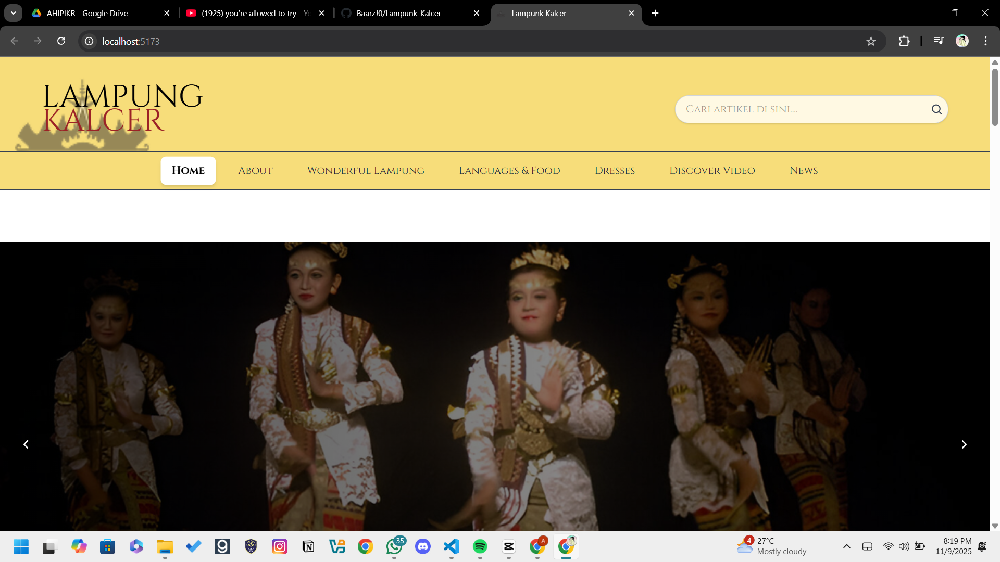
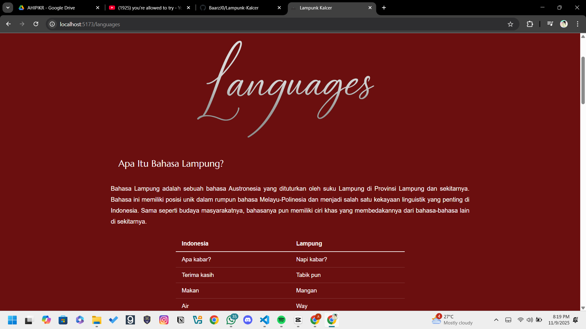
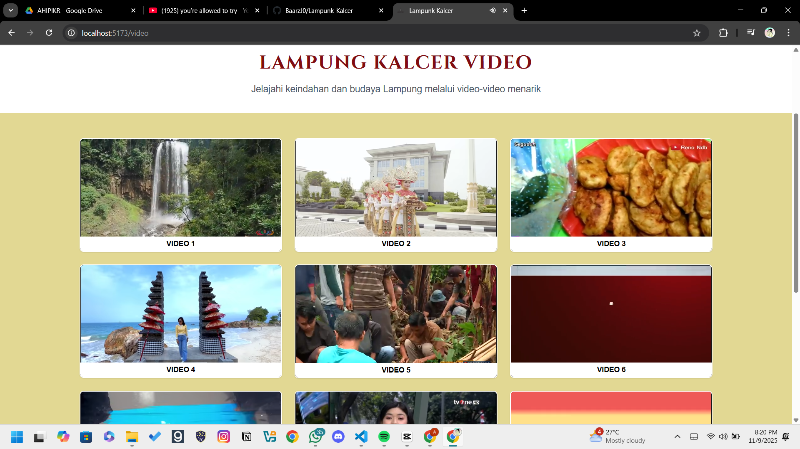
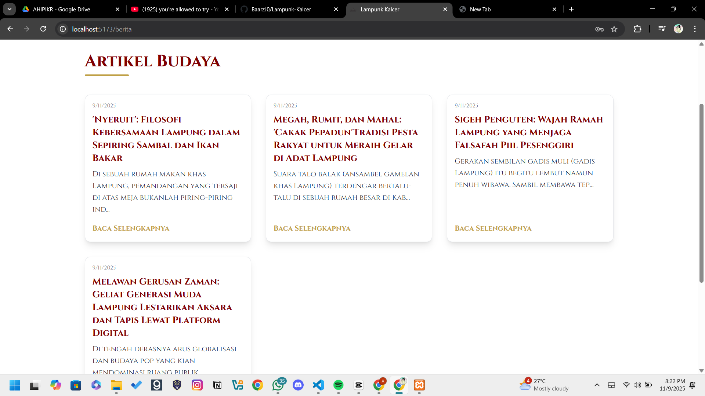

# Lampung Kalcer

Website yang dibuat oleh kelompok 03 LKMO HMIF 2025 (tim budaya), untuk menampilkan keindahan dan budaya Lampung. Aplikasi ini menggunakan arsitektur modern dengan React.js sebagai frontend dan Laravel sebagai backend untuk memberikan pengalaman yang optimal dalam menjelajahi kekayaan budaya Lampung.

## Arsitektur Sistem

### Frontend (React + Vite)
- Single Page Application (SPA) dengan React.js
- State management untuk pengelolaan data
- Routing yang dinamis dengan React Router
- UI/UX responsif dengan Tailwind CSS
- Optimasi performa dengan Vite

### Backend (Laravel)
- RESTful API dengan Laravel 10
- Autentikasi menggunakan Laravel Sanctum
- Database MySQL untuk penyimpanan data
- File storage untuk media dan gambar
- API Rate limiting dan security measures

## Screenshots

### Halaman Utama

*Tampilan utama website Lampung Kalcer*

### Halaman Bahasa

*Eksplorasi kekayaan bahasa dan budaya Lampung*

### Halaman Video

*Koleksi video tentang keindahan Lampung*

### Halaman Berita

*Portal berita dan informasi terkini*

## Fitur

- 🏔️ **Wonderful Lampung** - Jelajahi keindahan alam Lampung
- 🍽️ **Languages & Food** - Pelajari bahasa dan nikmati kuliner khas
- 👗 **Dresses** - Kenali pakaian tradisional Lampung
- 🎥 **Discover Video** - Tonton video tentang Lampung
- 📱 **Responsive Design** - Optimal di semua perangkat
- ⚡ **Fast Loading** - Dibangun dengan Vite untuk performa terbaik

## Teknologi yang Digunakan

### Frontend
- **React 19** - Library JavaScript untuk UI
- **Vite** - Build tool yang cepat
- **Tailwind CSS** - Framework CSS utility-first
- **React Router DOM** - Routing untuk SPA
- **Font Awesome** - Icons
- **Google Fonts** - Typography (Playfair Display & Poppins)

### Backend
- **Laravel 10** - PHP Framework
- **MySQL** - Database Management System
- **Composer** - PHP Package Manager
- **Laravel Sanctum** - API Authentication
- **Intervention Image** - Image Processing Library
- **PHP Unit** - Testing Framework

## Instalasi

### Frontend
1. Clone repository ini
   ```bash
   git clone (link repo github)
   ```
2. Install dependencies frontend:
   ```bash
   npm install
   ```
3. Copy file environment:
   ```bash
   cp .env.example .env
   ```
4. Jalankan development server:
   ```bash
   npm run dev
   ```
5. Buka browser dan akses `http://localhost:5173`

### Backend
1. Masuk ke direktori backend:
   ```bash
   cd backend/laravel
   ```
2. Install dependencies backend:
   ```bash
   composer install
   ```
3. Copy file environment Laravel:
   ```bash
   cp .env.example .env
   ```
4. Generate application key:
   ```bash
   php artisan key:generate
   ```
5. Setup database di file .env:
   ```
   DB_CONNECTION=mysql
   DB_HOST=127.0.0.1
   DB_PORT=3306
   DB_DATABASE=lampung_kalcer
   DB_USERNAME=root
   DB_PASSWORD=
   ```
6. Jalankan migrasi database:
   ```bash
   php artisan migrate
   ```
7. Jalankan seeder (optional):
   ```bash
   php artisan db:seed
   ```
8. Jalankan server Laravel:
   ```bash
   php artisan serve
   ```
9. Backend akan berjalan di `http://localhost:8000`

## Scripts

- `npm run dev` - Menjalankan development server
- `npm run build` - Build untuk production
- `npm run preview` - Preview build production
- `npm run lint` - Menjalankan ESLint

## Struktur Proyek

### Frontend Structure
```
src/
├── components/            # Reusable Components
│   ├── Navbar.jsx        # Navigation Component
│   ├── Footer.jsx        # Footer Component
│   └── PrivateRoute.jsx  # Auth Route Component
├── pages/                # Page Components
│   ├── HomePage.jsx      # Home Page
│   ├── RegionPage.jsx    # Region Information
│   ├── DressesPage.jsx   # Traditional Dresses
│   └── Dashboard/        # Admin Dashboard
├── assets/               # Static Assets
│   ├── images/          # Image Resources
│   └── styles/          # Style Resources
└── App.jsx              # Main Application
```

### Backend Structure
```
backend/laravel/
├── app/
│   ├── Http/
│   │   ├── Controllers/  # API Controllers
│   │   └── Middleware/   # Custom Middleware
│   ├── Models/          # Database Models
│   └── Providers/       # Service Providers
├── database/
│   ├── migrations/      # Database Migrations
│   └── seeders/        # Database Seeders
├── routes/
│   ├── api.php         # API Routes
│   └── web.php         # Web Routes
└── tests/              # Application Tests
```

## API Endpoints

### Authentication
- POST `/api/auth/login` - Login user
- POST `/api/auth/register` - Register new user
- POST `/api/auth/logout` - Logout user

### Content Management
- GET `/api/regions` - Get all regions
- GET `/api/regions/{id}` - Get specific region
- GET `/api/news` - Get all news
- POST `/api/news` - Create news (admin)
- GET `/api/dresses` - Get traditional dresses
- POST `/api/upload` - Upload media files

## Tim Pengembang

| Nama                    | NIM           | Role                    |
|------------------------|---------------|-------------------------|
| [Keira Lakeisha Fachra Fuady]       | [123140142]        | Project Manager         |
| [Muhammad Fadhilah Akbar]       | [123140003]        | Frontend Developer      |
| [Louis Hutabarat]       | [123140052]        | Frontend Developer      |
| [Anisah Octa Rohila]       | [123140137]        | Backend Developer       |
| [M. Arif Ardani]       | [12314086]        | Backend Developer       |
| [Silvia]       | [123140133]        | Backend Developer       |
| [M. Daffa Hakim Matondang]       | [123140002]        | UI/UX Designer          |
| [Najwa Syahirah Rosyan]       | [123140178]        | UI/UX Designer          |

## Lisensi

© 2025 Lampung Kalcer LKMO HMIF 2025 Kelompok 3 (tim budaya). Semua hak dilindungi.